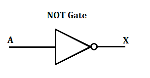
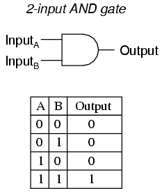
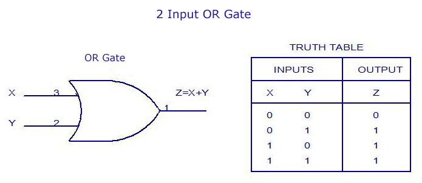
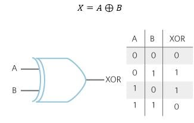
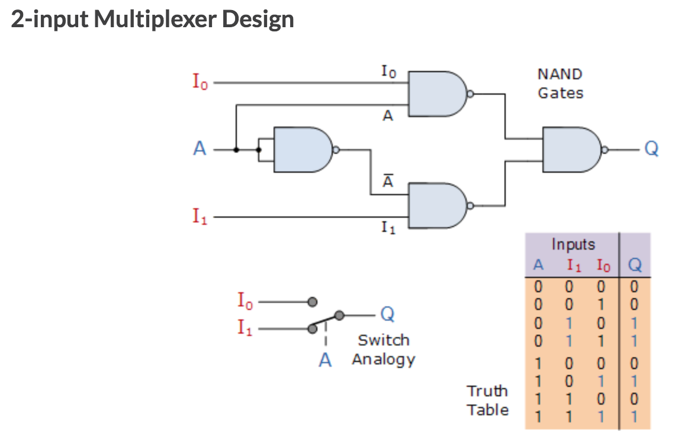
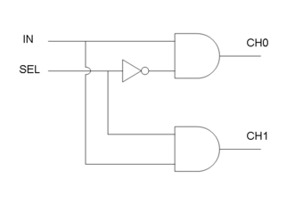

NOT gate

not gate used to inverse the input and output an oposite value.

And Gate

And Gate need both input with value of 1 to output a value of 1

Or gate

Or gate would output a value of 1, with either x or y having a value of 1.

Xor gate

xor gate would output a value of 1, if either A or B have a value of 1, but not both with the value of 1.

Mux	gate

A multiplexer makes it possible for several input signals to share one device or resource

Demux gate

The signal on the select line helps to switch the input to one of the two outputs.
